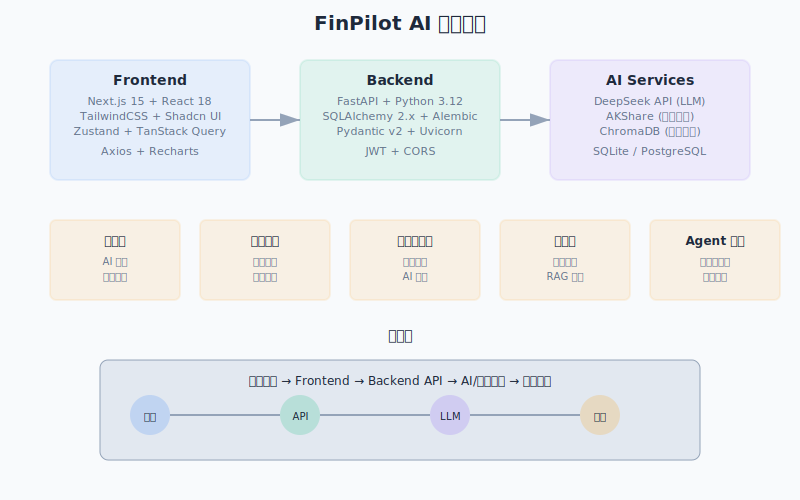
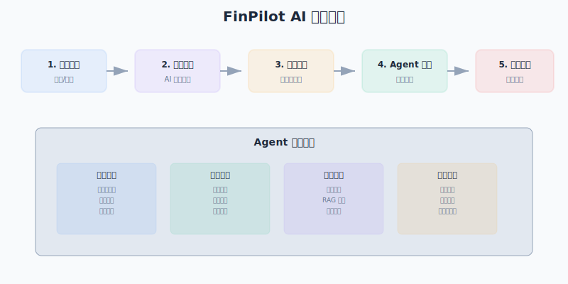

<div align="center">
  
  <h1>FinPilot AI</h1>
  <p><strong>AI 驱动的金融智能平台</strong> — 金融学习 · 股票研究 · 知识管理 · 多 Agent 协作</p>
  <p>
    
    
    
    
    
    
  </p>
  <p>
    
    
  </p>
</div>

---

## 目录

- [1. 项目介绍](#1-项目介绍)
- [2. 产品截图](#2-产品截图)
- [3. 技术架构图](#3-技术架构图)
- [4. 系统流程图](#4-系统流程图)
- [5. 功能介绍](#5-功能介绍)
- [6. AI 架构](#6-ai-架构)
- [7. RAG 架构](#7-rag-架构)
- [8. Multi-Agent 架构](#8-multi-agent-架构)
- [9. 技术栈](#9-技术栈)
- [10. 项目目录](#10-项目目录)
- [11. 本地部署](#11-本地部署)
- [12. Docker 部署](#12-docker-部署)
- [13. 环境变量说明](#13-环境变量说明)
- [14. API 文档](#14-api-文档)
- [15. 常见问题](#15-常见问题)
- [16. Roadmap](#16-roadmap)
- [17. License](#17-license)
- [18. Contributors](#18-contributors)
- [19. Star History](#19-star-history)
- [20. 致谢](#20-致谢)

---

## 1. 项目介绍

**FinPilot AI** 是一款面向金融领域的 AI 智能工作台，集 **AI 金融学习**、**AI 股票研究**、**AI 知识库管理（RAG）** 与 **多 Agent 协作** 于一体。项目采用前后端分离的 Monorepo 架构，前端基于 Next.js 15 + React 18 + TypeScript + TailwindCSS v4，后端基于 FastAPI + Python 3.12 + SQLAlchemy，AI 能力深度集成 DeepSeek API 大语言模型与 ChromaDB 向量数据库，股票数据通过 AKShare 获取真实市场行情。

本项目为参加 **TRAE AI 创造力大赛** 而开发，旨在打造一款全能的金融 AI 助手，助力用户高效进行金融学习、股票研究与知识管理。

### 核心功能

- **AI 金融学习助手** — 系统化的金融知识学习平台，覆盖 431 金融学综合全部考点，支持知识点讲解、练习题生成与错题本管理
- **AI 股票研究员** — 基于 AKShare 真实数据的智能股票分析，支持股票搜索、详情查询、K 线图表与 AI 深度研究报告生成
- **AI 知识库（RAG）** — 基于 ChromaDB + DeepSeek LLM 的检索增强生成系统，支持文档上传、向量化存储与智能问答
- **多 Agent 协作** — 4 位 AI 专家（学习专家、研究分析师、知识专家、报告撰写专家）协同工作，自动规划任务并合并结果
- **AI 工作台** — 流式对话工作区间，支持 SSE 实时输出，配备会话管理与状态面板

---

## 2. 产品截图

### 工作台


### 学习中心


### 股票研究员


### 知识库


### 设置


### 404 页面


---

## 3. 技术架构图



架构说明：前端 Next.js 15 应用通过 HTTP/SSE 与后端 FastAPI 通信；后端集成 DeepSeek LLM 提供对话与推理能力，通过 ChromaDB 实现向量检索，通过 AKShare 获取实时股票数据；支持 SQLite/PostgreSQL 持久化存储与 Docker 容器化部署。

---

## 4. 系统流程图



流程图说明：用户请求进入系统后，经 Multi-Agent Orchestrator 意图识别与任务规划，分配至对应 AI 专家（Learning/Research/Knowledge/Report Expert），各专家并行或串行执行任务后合并结果，最终通过流式/非流式方式返回给用户。

---

## 5. 功能介绍

### 5.1 AI 金融学习助手

覆盖 431 金融学综合全部核心考点，包括货币银行学、公司金融、投资学、国际金融等。提供以下功能：

- **系统课程** — 结构化金融课程体系，从基础到进阶逐步深入
- **知识点讲解** — AI 对每个知识点进行定义、详解、考点分析、经典例题与记忆口诀多维度讲解
- **练习题生成** — 支持选择题、简答题、计算题等多种题型，自动批改并记录成绩
- **错题本** — 自动收集答错题目，支持错题回顾与针对性复习
- **学习报告** — 统计分析学习进度、正确率与薄弱知识点

### 5.2 AI 股票研究员

基于 AKShare 开源股票数据接口，获取真实 A 股市场数据，结合 DeepSeek LLM 进行深度分析：

- **股票搜索** — 支持模糊搜索，实时获取 A 股股票基本信息
- **股票详情** — 展示价格、涨跌幅、成交量、市值、PE/PB、股息率、52 周高低等关键指标
- **K 线图表** — 日线级别 K 线数据展示
- **AI 研究报告** — 从技术面、基本面、风险三个维度进行 AI 深度分析，生成投资研究报告
- **自选股管理** — 添加/移除自选股，实时跟踪关注标的

### 5.3 AI 知识库（RAG）

基于 ChromaDB 向量数据库 + DeepSeek LLM 的检索增强生成（RAG）系统：

- **文档上传** — 支持 TXT、MD、PDF、DOCX、PPTX 等多种格式
- **智能切块** — 滑动窗口算法将文档切分为优化尺寸的文本块
- **向量化存储** — 通过 Embedding 服务将文本块转换为向量并存入 ChromaDB
- **语义检索** — 基于向量相似度检索最相关的内容片段
- **AI 问答** — 结合检索结果与 LLM 生成精准、可溯源的回答
- **文档管理** — 查看、分类、删除文档，实时展示知识库统计信息

### 5.4 多 Agent 协作（专家团队）

系统内置 4 位 AI 专家，可协同完成复杂金融任务：

| 专家 | 角色 | 核心能力 |
|------|------|----------|
| 📚 Learning Expert | 金融学习专家 | 知识讲解、课程辅导、考研梳理、题目解析、学习规划 |
| 📈 Research Expert | 股票研究分析师 | 基本面分析、技术分析、财务分析、风险评估、投资建议 |
| 🧠 Knowledge Expert | 知识库专家 | RAG 检索、文档引用、知识整理、研报提取、概念关联 |
| 📄 Report Expert | 报告撰写专家 | 结果整合、格式统一、表达优化、最终报告生成 |

### 5.5 AI 工作台（流式对话）

- **流式对话** — 基于 SSE 的实时流式输出，逐 token 展示 AI 思考过程
- **会话管理** — 支持多会话切换，历史消息持久化
- **上下文感知** — 保持对话上下文的连贯性
- **状态面板** — 实时展示系统状态、知识库统计等信息

### 5.6 智能设置

- **主题切换** — 明暗主题自由切换
- **API 配置** — DeepSeek API Key 在线配置
- **模型选择** — 支持不同模型参数调优
- **语言偏好** — 多语言界面支持

---

## 6. AI 架构

FinPilot AI 采用三层 AI 架构，从底层模型到上层应用实现完整智能化：

### 6.1 LLM 层（DeepSeek）

- **模型**：集成 DeepSeek Chat 大语言模型（deepseek-chat），兼容 OpenAI SDK 格式
- **对话能力**：支持非流式（完整回复）与流式（SSE 逐 token 输出）两种模式
- **重试机制**：指数退避重试策略，最多 3 次自动重试，应对 API 限流与网络抖动
- **Token 估算**：内置中英文 Token 估算器，支持对输入/输出进行成本预估

### 6.2 流式架构

前端通过 EventSource 或 Fetch API 发起流式请求，后端 FastAPI 以 `StreamingResponse` 返回 `text/event-stream` 格式数据：

```
User → POST /api/v1/chat/stream → FastAPI → AsyncOpenAI SDK → DeepSeek API
                                                                        ↓
User ← SSE events (data: {...})  ← FastAPI stream  ←  async generator
```

### 6.3 多 Agent 编排

Orchestrator（调度中心）作为多 Agent 系统的核心控制器，负责：

1. **意图识别** — 分析用户查询，判断所属领域（研究/学习/知识/通用）
2. **任务规划** — 根据意图拆解为可执行的任务步骤
3. **依赖管理** — 识别任务之间的依赖关系，确保执行顺序正确
4. **专家分配** — 为每个任务分配最合适的 AI 专家
5. **结果合并** — 收集各专家执行结果，合并生成最终回答

### 6.4 RAG 流水线

完整的 RAG 流水线涵盖从文档摄入到智能问答的全流程：

```
文档上传 → 文本切块 → Embedding 向量化 → ChromaDB 存储
                                                    ↓
用户提问 → Embedding 向量化 → 向量相似度检索 → 上下文组装 → LLM 生成 → 回答
```

---

## 7. RAG 架构

FinPilot AI 的知识库系统采用完整的检索增强生成（RAG）架构，流程如下：

```
┌─────────────┐    ┌─────────────┐    ┌─────────────┐    ┌─────────────┐
│  文档上传    │ → │  文本切块    │ → │  Embedding  │ → │  ChromaDB   │
│  Document   │    │   Chunking  │    │  向量化     │    │  向量存储   │
│  Upload     │    │  (滑动窗口)  │    │  (768维)    │    │  Vector DB  │
└─────────────┘    └─────────────┘    └─────────────┘    └─────────────┘
                                                                      │
┌─────────────┐    ┌─────────────┐    ┌─────────────┐                 │
│  最终回答    │ ← │  LLM 生成   │ ← │  上下文组装  │ ← 相似度检索     │
│  Answer     │    │  DeepSeek   │    │  Context    │    (top_k=5)     │
└─────────────┘    └─────────────┘    └─────────────┘                 │
                                                              ┌───────┴───────┐
                                                              │  用户提问     │
                                                              │  User Query   │
                                                              └───────────────┘
```

### 各组件详解

| 组件 | 技术 | 说明 |
|------|------|------|
| 文档上传 | FastAPI Router | 接收文档元数据（文件名、类型、分类、标签） |
| 文本切块 | `chunk_text()` 滑动窗口 | 默认 chunk_size=500, chunk_overlap=50 字符 |
| Embedding | `DeepSeek Embedding` / Mock | 768 维向量，L2 归一化，支持多种 Embedding 后端 |
| 向量存储 | ChromaDB (PersistentClient) | 持久化 `finpilot_knowledge` Collection，支持元数据过滤 |
| 相似度检索 | ChromaDB `query()` | 支持 `top_k` 配置（默认 5）和 `category` 分类过滤 |
| 上下文组装 | `RAGService._build_context()` | 将检索片段按相关性排序并组装为 LLM prompt |
| LLM 生成 | DeepSeek Chat (temperature=0.3) | 低温度确保严谨性，回答中引用知识片段 |

---

## 8. Multi-Agent 架构

FinPilot AI 的多 Agent 系统采用 **Orchestrator（调度中心）** 模式，实现智能任务规划与专家协作。

### 8.1 系统角色

```
                    ┌──────────────────────┐
                    │   Orchestrator       │
                    │   调度中心           │
                    │  (意图识别 + 任务规划)│
                    └──────┬───────────────┘
                           │
           ┌───────────────┼───────────────────┐
           │               │                   │           │
    ┌──────▼──────┐ ┌─────▼──────┐ ┌────────▼─────┐ ┌────▼──────┐
    │  Learning   │ │  Research  │ │  Knowledge   │ │  Report   │
    │  Expert     │ │  Analyst   │ │  Expert      │ │  Writer   │
    │ (金融学习)   │ │ (股票研究)  │ │ (知识管理)    │ │ (报告撰写) │
    └─────────────┘ └────────────┘ └──────────────┘ └───────────┘
```

### 8.2 调度流程

```
Step 1: 意图识别 (Intent Recognition)
        用户查询 → 关键词匹配 → 意图分类
        ├── "分析茅台" → research_report
        ├── "CAPM模型" → learning_report
        ├── "研报总结" → knowledge_report
        ├── "茅台+431" → complex_research_knowledge_learning
        └── 其他 → general_chat

Step 2: 任务规划 (Task Planning)
        意图 → 拆解为多个 TaskPlan
        示例 (complex_research_knowledge_learning):
        ├── Task 1: Research Expert - 股票深度分析
        ├── Task 2: Knowledge Expert - 研报资料检索
        ├── Task 3: Learning Expert - 431知识点提炼 [depends: T1, T2]
        └── Task 4: Report Expert - 整合生成报告   [depends: T3]

Step 3: 依赖执行 (Dependency Execution)
        按 DAG 拓扑顺序执行任务
        ├── Task 1 (并行) Task 2 ──→ Task 3 ──→ Task 4
        └── 无依赖任务并行执行

Step 4: 结果合并 (Result Merging)
        各专家结果 → 合并 → 最终回答
```

### 8.3 任务状态机

```
         ┌─────────┐
         │ Pending │ ─── 等待执行
         └────┬────┘
              │ (依赖条件满足)
              ▼
         ┌─────────┐
         │ Running │ ─── 正在执行
         └────┬────┘
              │
         ┌────▼────┐     ┌───────┐
         │  Done   │ 或  │ Error │
         └─────────┘     └───────┘
```

### 8.4 工作流状态

```
planning (0%) → executing (1-99%) → merging (100%) → completed
                                                      → error (任意阶段)
```

---

## 9. 技术栈

| 分类 | 技术 | 版本 | 说明 |
|------|------|------|------|
| **前端** | Next.js | 15.3.2 | React 全栈框架，App Router |
| | React | 18.3.1 | UI 组件库基础 |
| | TypeScript | 5.x | 类型安全 |
| | TailwindCSS | 4.3.1 | 原子化 CSS 框架 |
| | Zustand | 5.0.14 | 轻量状态管理 |
| | Axios | 1.18.0 | HTTP 客户端 |
| | Recharts | 3.8.1 | 图表可视化 |
| | Lucide React | 1.21.0 | 图标库 |
| | React Hook Form | 7.80.0 | 表单管理 |
| | Zod | 4.4.3 | 数据验证 |
| | class-variance-authority | 0.7.1 | 组件样式变体 |
| **后端** | FastAPI | latest | 异步 Web 框架 |
| | Python | 3.12 | 编程语言 |
| | SQLAlchemy | 2.x | ORM 框架 |
| | Alembic | latest | 数据库迁移 |
| | Pydantic | v2 | 数据验证与序列化 |
| | Uvicorn | latest | ASGI 服务器 |
| **AI & 数据** | DeepSeek API | deepseek-chat | 大语言模型 |
| | ChromaDB | latest | 向量数据库 |
| | AKShare | latest | 开源股票数据接口 |
| | OpenAI Python SDK | latest | LLM API 封装 |
| **基础设施** | Docker Compose | 3.8 | 容器化编排 |
| | SQLite | development | 开发数据库 |
| | PostgreSQL | production (预留) | 生产数据库 |

---

## 10. 项目目录

```
FinPilot/
├── apps/
│   ├── web/                              # Next.js 前端应用
│   │   ├── src/
│   │   │   ├── app/                      # App Router 路由
│   │   │   │   ├── (auth)/               # 认证路由组
│   │   │   │   │   ├── login/
│   │   │   │   │   └── register/
│   │   │   │   ├── (dashboard)/          # 仪表盘路由组
│   │   │   │   │   ├── knowledge/        # 知识库页面
│   │   │   │   │   ├── learn/            # 学习中心页面
│   │   │   │   │   ├── settings/         # 设置页面
│   │   │   │   │   ├── stocks/           # 股票研究员页面
│   │   │   │   │   ├── workspace/        # 工作台页面
│   │   │   │   │   ├── layout.tsx        # 仪表盘布局
│   │   │   │   │   └── loading.tsx       # 加载状态
│   │   │   │   ├── favicon.ico
│   │   │   │   ├── favicon.svg
│   │   │   │   ├── globals.css           # 全局样式
│   │   │   │   ├── layout.tsx            # 根布局
│   │   │   │   ├── not-found.tsx         # 404 页面
│   │   │   │   └── page.tsx              # 首页
│   │   │   ├── components/               # React 组件
│   │   │   │   ├── knowledge/            # 知识库组件
│   │   │   │   │   ├── document-manager.tsx
│   │   │   │   │   ├── index.ts
│   │   │   │   │   ├── knowledge-center.tsx
│   │   │   │   │   ├── knowledge-sidebar.tsx
│   │   │   │   │   └── rag-panel.tsx
│   │   │   │   ├── layout/               # 布局组件
│   │   │   │   │   ├── app-layout.tsx
│   │   │   │   │   ├── index.ts
│   │   │   │   │   ├── page-container.tsx
│   │   │   │   │   ├── sidebar.tsx
│   │   │   │   │   └── top-nav.tsx
│   │   │   │   ├── learning/             # 学习中心组件
│   │   │   │   │   ├── chapter-content.tsx
│   │   │   │   │   ├── course-sidebar.tsx
│   │   │   │   │   ├── exercise-panel.tsx
│   │   │   │   │   ├── index.ts
│   │   │   │   │   ├── learning-center.tsx
│   │   │   │   │   └── study-stats-panel.tsx
│   │   │   │   ├── stock/                # 股票组件
│   │   │   │   │   ├── analysis-status.tsx
│   │   │   │   │   ├── index.ts
│   │   │   │   │   ├── mini-chart.tsx
│   │   │   │   │   ├── research-report.tsx
│   │   │   │   │   ├── search-sidebar.tsx
│   │   │   │   │   ├── stock-header.tsx
│   │   │   │   │   └── stock-terminal.tsx
│   │   │   │   ├── ui/                   # UI 基础组件
│   │   │   │   │   ├── badge.tsx
│   │   │   │   │   ├── button.tsx
│   │   │   │   │   ├── card.tsx
│   │   │   │   │   ├── chart.tsx
│   │   │   │   │   ├── drawer.tsx
│   │   │   │   │   ├── empty.tsx
│   │   │   │   │   ├── index.ts
│   │   │   │   │   ├── input.tsx
│   │   │   │   │   ├── loading.tsx
│   │   │   │   │   ├── modal.tsx
│   │   │   │   │   ├── skeleton.tsx
│   │   │   │   │   ├── table.tsx
│   │   │   │   │   ├── tabs.tsx
│   │   │   │   │   └── toast.tsx
│   │   │   │   └── workspace/            # 工作台组件
│   │   │   │       ├── chat-area.tsx
│   │   │   │       ├── chat-input.tsx
│   │   │   │       ├── conversation-sidebar.tsx
│   │   │   │       ├── index.ts
│   │   │   │       ├── status-panel.tsx
│   │   │   │       └── workspace-layout.tsx
│   │   │   ├── lib/                      # 工具库
│   │   │   │   ├── request.ts            # Axios 封装
│   │   │   │   └── utils.ts              # 通用工具函数
│   │   │   ├── store/                    # Zustand 状态管理
│   │   │   │   ├── conversation-store.ts
│   │   │   │   ├── exercise-store.ts
│   │   │   │   ├── index.ts
│   │   │   │   ├── knowledge-store.ts
│   │   │   │   ├── learning-store.ts
│   │   │   │   ├── message-store.ts
│   │   │   │   ├── mistake-store.ts
│   │   │   │   ├── notification-store.ts
│   │   │   │   ├── research-store.ts
│   │   │   │   ├── retriever-store.ts
│   │   │   │   ├── setting-store.ts
│   │   │   │   ├── sidebar-store.ts
│   │   │   │   ├── stock-store.ts
│   │   │   │   ├── study-plan-store.ts
│   │   │   │   ├── theme-store.ts
│   │   │   │   ├── user-store.ts
│   │   │   │   ├── watchlist-store.ts
│   │   │   │   └── workspace-store.ts
│   │   │   └── types/                    # TypeScript 类型定义
│   │   │       ├── index.ts
│   │   │       ├── knowledge.ts
│   │   │       ├── learning.ts
│   │   │       ├── stock.ts
│   │   │       └── workspace.ts
│   │   ├── .env.example
│   │   ├── .gitignore
│   │   ├── components.json
│   │   ├── eslint.config.mjs
│   │   ├── next-env.d.ts
│   │   ├── next.config.mjs
│   │   ├── package.json
│   │   ├── postcss.config.mjs
│   │   └── tsconfig.json
│   └── api/                              # FastAPI 后端应用
│       ├── alembic/                      # 数据库迁移
│       │   ├── env.py
│       │   └── script.py.mako
│       ├── core/                         # 核心配置
│       │   ├── __init__.py
│       │   ├── ai_client.py              # DeepSeek LLM 客户端封装
│       │   ├── cache.py                  # 缓存模块
│       │   ├── config.py                 # Pydantic Settings 配置
│       │   └── logger.py                 # 日志模块
│       ├── database/                     # 数据库配置
│       │   ├── __init__.py
│       │   └── base.py                   # SQLAlchemy Base
│       ├── routers/                      # API 路由
│       │   ├── __init__.py
│       │   ├── agent.py                  # Multi-Agent 路由
│       │   ├── chat.py                   # 对话路由
│       │   ├── health.py                 # 健康检查
│       │   ├── knowledge.py              # 知识库路由
│       │   ├── learning.py               # 学习路由
│       │   └── stock.py                  # 股票路由
│       ├── schemas/                      # Pydantic 数据模型
│       │   ├── __init__.py
│       │   ├── agent.py                  # Agent Schemas
│       │   ├── chat.py                   # 对话 Schemas
│       │   ├── knowledge.py              # 知识库 Schemas
│       │   ├── learning.py               # 学习 Schemas
│       │   └── stock.py                  # 股票 Schemas
│       ├── services/                     # 业务逻辑服务
│       │   ├── __init__.py
│       │   ├── agent_manager.py          # AI 专家管理
│       │   ├── akshare_service.py        # AKShare 数据服务
│       │   ├── chat_service.py           # 对话服务
│       │   ├── chroma_service.py         # ChromaDB 向量服务
│       │   ├── chunk_service.py          # 文本切块服务
│       │   ├── course_service.py         # 课程服务
│       │   ├── document_service.py       # 文档管理服务
│       │   ├── embedding_service.py      # Embedding 服务
│       │   ├── exercise_service.py       # 练习题服务
│       │   ├── memory_manager.py         # 记忆管理服务
│       │   ├── mistake_service.py        # 错题本服务
│       │   ├── orchestrator_service.py   # 调度中心服务
│       │   ├── prompt_manager.py         # Prompt 模板管理
│       │   ├── rag_service.py            # RAG 核心服务
│       │   ├── report_service.py         # 学习报告服务
│       │   ├── research_service.py       # 股票研究服务
│       │   ├── retriever_service.py      # 检索服务
│       │   ├── stock_service.py          # 股票数据服务
│       │   └── workflow_manager.py       # 工作流管理
│       ├── .env.example
│       ├── alembic.ini
│       ├── main.py                       # 应用入口
│       └── requirements.txt
├── docker/                               # Docker 配置
│   ├── api.Dockerfile                    # 后端 Dockerfile
│   └── web.Dockerfile                    # 前端 Dockerfile
├── docs/                                 # 文档与截图
│   ├── screenshots/                      # 项目截图
│   │   ├── 404.png
│   │   ├── knowledge.png
│   │   ├── learn.png
│   │   ├── settings.png
│   │   ├── stocks.png
│   │   └── workspace.png
│   ├── architecture.svg                  # 技术架构图
│   ├── workflow.svg                      # 系统流程图
│   ├── logo.jpg                          # 项目 Logo
│   └── og-image.jpg                      # OpenGraph 分享图
├── .env.example                          # 全局环境变量模板
├── CHANGELOG.md                          # 变更日志
├── DEPLOY.md                             # 部署指南
├── README.md                             # 项目说明（本文件）
└── docker-compose.yml                    # Docker Compose 编排
```

---

## 11. 本地部署

### 环境要求

- **Node.js** >= 20
- **Python** >= 3.12
- **npm** >= 10

### 步骤一：克隆项目

```bash
git clone <repository-url>
cd FinPilot
```

### 步骤二：配置环境变量

```bash
# 复制环境变量模板
cp .env.example .env
cp apps/api/.env.example apps/api/.env

# 编辑 .env 文件，填入你的 DeepSeek API Key
# DEEPSEEK_API_KEY=your_api_key_here
```

### 步骤三：安装并启动后端

```bash
cd apps/api

# 创建 Python 虚拟环境
python -m venv venv

# 激活虚拟环境
# Windows:
venv\Scripts\activate
# macOS / Linux:
# source venv/bin/activate

# 安装依赖
pip install -r requirements.txt

# 运行数据库迁移
alembic upgrade head

# 启动 FastAPI 服务（热重载）
uvicorn main:app --reload --host 0.0.0.0 --port 8000
```

后端服务将运行在 http://localhost:8000

API 交互式文档（Swagger UI）：http://localhost:8000/docs

### 步骤四：安装并启动前端

```bash
cd apps/web

# 安装依赖
npm install

# 启动开发服务器
npm run dev
```

前端服务将运行在 http://localhost:3000

---

## 12. Docker 部署

### 一键启动（推荐）

```bash
# 构建并启动所有服务
docker-compose up --build

# 后台运行
docker-compose up -d

# 查看日志
docker-compose logs -f

# 停止服务
docker-compose down
```

### 服务说明

| 服务 | 容器名 | 端口 | 说明 |
|------|--------|------|------|
| API | finpilot-api | 8000 | FastAPI 后端 |
| Web | finpilot-web | 3000 | Next.js 前端 |

### 注意事项

- Dockerfile 配置已设计完成并文档化，可直接用于生产构建
- 后端 Dockerfile 基于 `python:3.12-slim`，包含 gcc、libpq-dev 等编译依赖
- 前端 Dockerfile 采用多阶段构建（deps → builder → runner），优化镜像体积
- 前端 `output: "standalone"` 已配置，支持独立运行
- Docker Compose 中 `web` 服务依赖 `api` 的健康检查，确保启动顺序正确
- 数据持久化通过 Docker Volume `api-data` 管理

---

## 13. 环境变量说明

| 变量名 | 说明 | 必填 | 默认值 |
|--------|------|------|--------|
| `DEEPSEEK_API_KEY` | DeepSeek API 密钥，用于调用大语言模型 | **是** | `sk-demo-key` |
| `DEEPSEEK_BASE_URL` | DeepSeek API 基础地址 | 否 | `https://api.deepseek.com` |
| `DEEPSEEK_MODEL` | DeepSeek 模型名称 | 否 | `deepseek-chat` |
| `DEEPSEEK_TIMEOUT` | API 请求超时时间（秒） | 否 | `60` |
| `DEEPSEEK_MAX_RETRIES` | API 请求最大重试次数 | 否 | `3` |
| `DATABASE_URL` | 数据库连接字符串 | 否 | `sqlite+aiosqlite:///./finpilot.db` |
| `JWT_SECRET` | JWT 签名密钥，用户认证 | **是** | `your_jwt_secret_here` |
| `JWT_EXPIRATION` | JWT Token 过期时间（秒） | 否 | `86400` |
| `CORS_ORIGINS` | 允许的跨域来源，逗号分隔 | 否 | `http://localhost:3000` |
| `CHROMADB_PATH` | ChromaDB 持久化路径 | 否 | `./chroma_data` |
| `APP_NAME` | 应用名称 | 否 | `FinPilot AI` |
| `APP_VERSION` | 应用版本 | 否 | `1.0.0` |
| `DEBUG` | 是否开启调试模式 | 否 | `true` |

**注意**：`DEEPSEEK_API_KEY` 和 `JWT_SECRET` 是必须配置的核心变量。DeepSeek API Key 请前往 [DeepSeek 官网](https://platform.deepseek.com/) 注册获取。

---

## 14. API 文档

所有 API 端点均以 `/api/v1` 为前缀。完整 API 文档可在服务启动后通过 Swagger UI（http://localhost:8000/docs）或 ReDoc（http://localhost:8000/redoc）查看。

### 系统管理

| 方法 | 路径 | 说明 | 请求参数 | 响应 |
|------|------|------|----------|------|
| GET | `/api/v1/health` | 健康检查 | 无 | `{"status": "ok", "version": "1.0.0", "time": "..."}` |

### 对话

| 方法 | 路径 | 说明 | 请求参数 | 响应 |
|------|------|------|----------|------|
| POST | `/api/v1/chat` | AI 对话（非流式） | `ChatRequest { message: string }` | `ChatResponse { reply: string }` |
| POST | `/api/v1/chat/stream` | AI 对话（流式 SSE） | `ChatRequest { message: string }` | SSE 事件流 |

### 股票

| 方法 | 路径 | 说明 | 请求参数 | 响应 |
|------|------|------|----------|------|
| GET | `/api/v1/stocks/search` | 模糊搜索股票 | `q: string` | `List<StockSearchResult>` |
| GET | `/api/v1/stocks/detail/{code}` | 获取股票详情 | `code: string` | `StockDetail` |
| GET | `/api/v1/stocks/chart/{code}` | 获取 K 线数据 | `code: string, period: string` | `StockChartData` |
| POST | `/api/v1/stocks/analyze` | AI 股票分析 | `StockAnalyzeRequest` | `ResearchReport` |
| GET | `/api/v1/stocks/watchlist` | 获取自选股列表 | 无 | `List<WatchlistItem>` |
| POST | `/api/v1/stocks/watchlist/{code}` | 添加自选股 | `code: string` | `WatchlistItem` |
| DELETE | `/api/v1/stocks/watchlist/{code}` | 移除自选股 | `code: string` | `{"success": true}` |

### 知识库

| 方法 | 路径 | 说明 | 请求参数 | 响应 |
|------|------|------|----------|------|
| POST | `/api/v1/knowledge/upload` | 上传文档 | `DocumentUpload` | `DocumentInfo` |
| GET | `/api/v1/knowledge/list` | 获取文档列表 | 无 | `DocumentListResponse` |
| GET | `/api/v1/knowledge/document/{document_id}` | 获取文档详情 | `document_id: string` | `DocumentInfo` |
| GET | `/api/v1/knowledge/document/{document_id}/chunks` | 获取文档切块 | `document_id: string` | `List<ChunkInfo>` |
| DELETE | `/api/v1/knowledge/{document_id}` | 删除文档 | `document_id: string` | `{"success": true}` |
| POST | `/api/v1/knowledge/query` | RAG 知识库查询 | `RAGQuery { query, top_k?, category? }` | `RAGAnswer` |
| GET | `/api/v1/knowledge/stats` | 获取知识库统计 | 无 | `KnowledgeStats` |

### 学习

| 方法 | 路径 | 说明 | 请求参数 | 响应 |
|------|------|------|----------|------|
| GET | `/api/v1/learn/courses` | 获取全部课程列表 | 无 | `List<Course>` |
| GET | `/api/v1/learn/courses/{course_id}` | 获取课程详情 | `course_id: string` | `Course` |
| GET | `/api/v1/learn/chapter/{chapter_id}` | 获取章节详情 | `chapter_id: string` | `Chapter` |
| POST | `/api/v1/learn/exercise` | 生成练习题 | `ExerciseRequest` | `ExerciseResponse` |
| POST | `/api/v1/learn/submit` | 提交答案并批改 | `SubmitExerciseRequest` | `SubmitExerciseResponse` |
| GET | `/api/v1/learn/mistakes` | 获取错题记录 | 无 | `List<MistakeRecord>` |
| DELETE | `/api/v1/learn/mistakes/{mistake_id}` | 删除错题记录 | `mistake_id: string` | `{"success": true}` |
| GET | `/api/v1/learn/report` | 获取学习报告 | 无 | `StudyReport` |
| POST | `/api/v1/learn/explain` | AI 知识点讲解 | `knowledge_point: string` | `AIExplanation` |

### Agent（多 Agent 协作）

| 方法 | 路径 | 说明 | 请求参数 | 响应 |
|------|------|------|----------|------|
| GET | `/api/v1/agent/agents` | 获取所有 AI 专家列表 | 无 | `List<AgentInfo>` |
| GET | `/api/v1/agent/agents/{agent_id}` | 获取 AI 专家详情 | `agent_id: string` | `AgentInfo` |
| POST | `/api/v1/agent/orchestrator` | 调度中心任务规划与执行 | `OrchestratorRequest { query, context? }` | `OrchestratorResponse` |
| GET | `/api/v1/agent/workflow/{workflow_id}` | 获取工作流执行状态 | `workflow_id: string` | `WorkflowStatus` |
| GET | `/api/v1/agent/prompts` | 获取所有 Prompt 模板 | 无 | `List<PromptTemplate>` |
| GET | `/api/v1/agent/memory` | 获取所有记忆条目 | 无 | `List<MemoryEntry>` |

---

## 15. 常见问题

### Q1: DeepSeek API Key 如何获取？

前往 [DeepSeek 开放平台](https://platform.deepseek.com/) 注册账号，在 API Keys 页面创建新的 API Key。目前 DeepSeek 提供一定的免费额度，足以完成开发和测试。

### Q2: AKShare 是否需要 API Key？

不需要。AKShare 是一个开源 Python 财经数据接口库，通过直接访问公开金融数据源获取数据，无需任何 API Key 或认证。

### Q3: 启动后端时提示 "No module named 'chromadb'" 怎么办？

ChromaDB 是可选依赖。如果没有安装，系统会自动降级为内存模式（In-Memory Fallback），不影响核心功能。如需完整功能，请执行：

```bash
pip install chromadb
```

### Q4: 前端启动后无法连接后端 API？

请检查以下几点：

1. 确认后端服务已在 `http://localhost:8000` 正常运行
2. 检查前端的 `NEXT_PUBLIC_API_BASE_URL` 环境变量是否配置正确
3. 检查后端的 `CORS_ORIGINS` 是否包含前端的访问地址（默认 `http://localhost:3000`）

### Q5: 本项目使用什么数据库？是否支持生产环境？

开发环境默认使用 SQLite，零配置即可运行。生产环境预留了 PostgreSQL 支持，只需将 `DATABASE_URL` 替换为 PostgreSQL 连接字符串即可切换。

### Q6: 如何添加新的课程或知识点？

目前课程和知识点数据以代码形式内置于 `course_service.py` 中。您可以直接修改该文件中的课程/章节/知识点数据源。后续版本将支持通过管理后台在线编辑。

---

## 16. Roadmap

### v1.0（当前版本 — 已完成）

- [x] Monorepo 项目结构与工程化配置
- [x] Next.js 15 + TailwindCSS v4 前端框架搭建
- [x] FastAPI + SQLAlchemy 后端框架搭建
- [x] AI 聊天功能（流式 + 非流式）
- [x] AI 金融学习助手（课程 + 练习 + 错题本）
- [x] AI 股票研究员（AKShare 数据 + AI 分析）
- [x] AI 知识库（RAG：ChromaDB + DeepSeek）
- [x] 多 Agent 协作系统（Orchestrator + 4 位专家）
- [x] AI 工作台（流式对话工作区间）
- [x] 智能设置页面
- [x] Docker 容器化部署
- [x] 完整文档与截图

### v1.1（规划中）

- [ ] 真实数据库迁移（SQLite → PostgreSQL）
- [ ] 用户认证与权限管理（JWT + OAuth2）
- [ ] 支付系统集成与订阅管理
- [ ] 管理员后台
- [ ] 国际化支持（i18n）
- [ ] 知识库文档预览（PDF/DOCX 在线查看）
- [ ] 股票实时行情 WebSocket

### v2.0（远景规划）

- [ ] 个人投资组合管理与回测
- [ ] 社区功能（用户分享、讨论、观点广场）
- [ ] AI 智能投顾（个性化资产配置建议）
- [ ] 移动端 App（React Native / Flutter）
- [ ] 多模型支持（接入 GPT-4、Claude 等）
- [ ] 金融数据 API 市场（第三方数据源接入）
- [ ] 插件系统（开发者可扩展自定义 Agent）

---

## 17. License

MIT License

Copyright (c) 2025 TRAE AI 创造力大赛 - FinPilot AI Team

Permission is hereby granted, free of charge, to any person obtaining a copy
of this software and associated documentation files (the "Software"), to deal
in the Software without restriction, including without limitation the rights
to use, copy, modify, merge, publish, distribute, sublicense, and/or sell
copies of the Software, and to permit persons to whom the Software is
furnished to do so, subject to the following conditions:

The above copyright notice and this permission notice shall be included in all
copies or substantial portions of the Software.

THE SOFTWARE IS PROVIDED "AS IS", WITHOUT WARRANTY OF ANY KIND, EXPRESS OR
IMPLIED, INCLUDING BUT NOT LIMITED TO THE WARRANTIES OF MERCHANTABILITY,
FITNESS FOR A PARTICULAR PURPOSE AND NONINFRINGEMENT. IN NO EVENT SHALL THE
AUTHORS OR COPYRIGHT HOLDERS BE LIABLE FOR ANY CLAIM, DAMAGES OR OTHER
LIABILITY, WHETHER IN AN ACTION OF CONTRACT, TORT OR OTHERWISE, ARISING FROM,
OUT OF OR IN CONNECTION WITH THE SOFTWARE OR THE USE OR OTHER DEALINGS IN THE
SOFTWARE.

---

## 18. Contributors

本项目由 **TRAE AI 创造力大赛** 参赛团队开发维护。

### 核心贡献者

<!-- 在此添加团队成员信息 -->

| 角色 | 姓名 | 贡献 |
|------|------|------|
| 项目负责人 | TBD | 项目管理、架构设计 |
| 前端开发 | TBD | Next.js 前端开发 |
| 后端开发 | TBD | FastAPI 后端开发 |
| AI 工程师 | TBD | LLM 集成、RAG 实现 |
| UI/UX 设计 | TBD | 界面设计、交互体验 |

### 参与贡献

欢迎通过以下方式参与项目：

1. Fork 本仓库
2. 创建特性分支 (`git checkout -b feature/amazing-feature`)
3. 提交更改 (`git commit -m 'feat: add amazing feature'`)
4. 推送分支 (`git push origin feature/amazing-feature`)
5. 创建 Pull Request

---

## 19. Star History

<div align="center">
  <p><em>Star History 功能即将上线...</em></p>
  <p>如果您喜欢这个项目，请点击右上角 ⭐ Star 支持我们！</p>
</div>

---

## 20. 致谢

### 特别感谢

- **TRAE** — 感谢 TRAE AI 创造力大赛提供的平台与技术支持，让我们能够充分发挥创造力，打造这款金融 AI 产品
- **DeepSeek** — 感谢 DeepSeek 提供的高性能大语言模型 API，为 FinPilot AI 提供了强大的 AI 推理与生成能力
- **AKShare** — 感谢 AKShare 开源项目提供的免费、便捷的 A 股数据接口，让我们的股票分析功能拥有真实数据支撑
- **ChromaDB** — 感谢 ChromaDB 团队开发的轻量级向量数据库，为 RAG 系统提供了可靠的基础设施

### 开源社区

感谢以下开源项目及社区的支持：

- [Next.js](https://nextjs.org/) — React 全栈框架
- [FastAPI](https://fastapi.tiangolo.com/) — 高性能异步 Web 框架
- [React](https://react.dev/) — UI 组件库
- [TailwindCSS](https://tailwindcss.com/) — 原子化 CSS 框架
- [Zustand](https://github.com/pmndrs/zustand) — 轻量状态管理
- [SQLAlchemy](https://www.sqlalchemy.org/) — Python ORM 框架
- [Alembic](https://alembic.sqlalchemy.org/) — 数据库迁移工具
- [Pydantic](https://docs.pydantic.dev/) — 数据验证与序列化
- [Recharts](https://recharts.org/) — React 图表库
- [Lucide](https://lucide.dev/) — 开源图标库
- [OpenAI Python SDK](https://github.com/openai/openai-python) — LLM API 封装
- 以及所有为本项目提供依赖的开源项目

---

<div align="center">
  <p>
    <strong>FinPilot AI</strong> — 让金融智能触手可及
  </p>
  <p>
    Built with ❤️ for <strong>TRAE AI 创造力大赛</strong>
  </p>
</div>