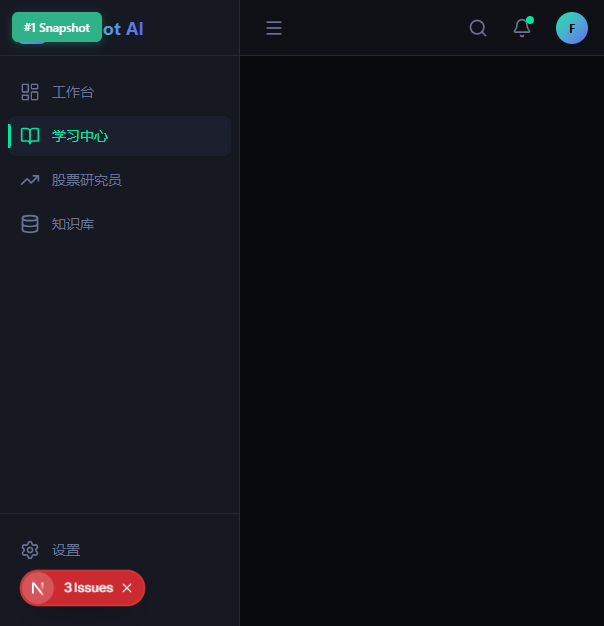
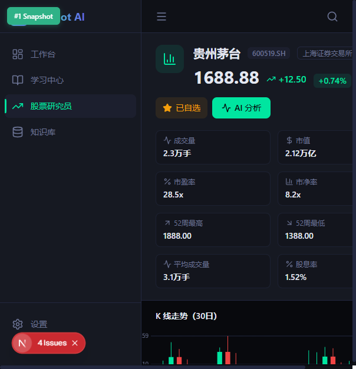
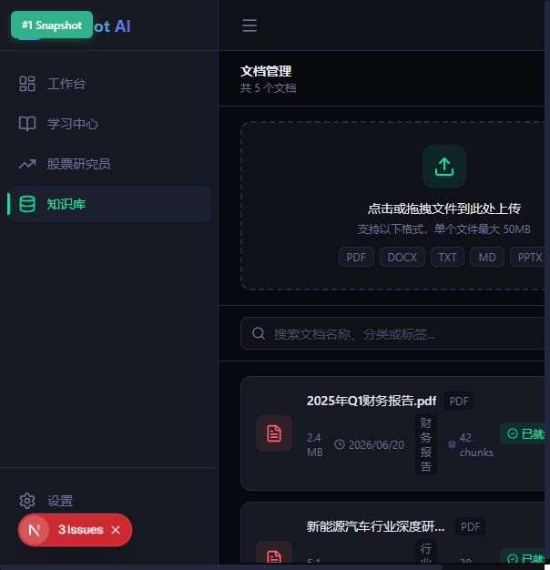
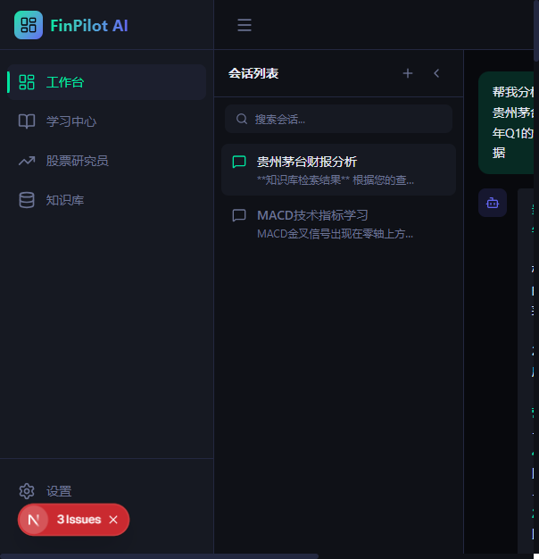
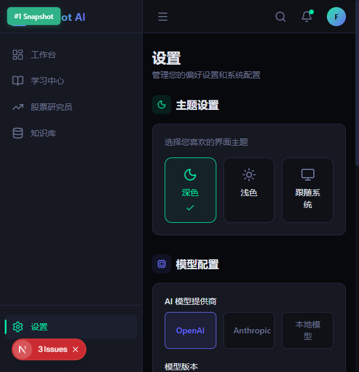
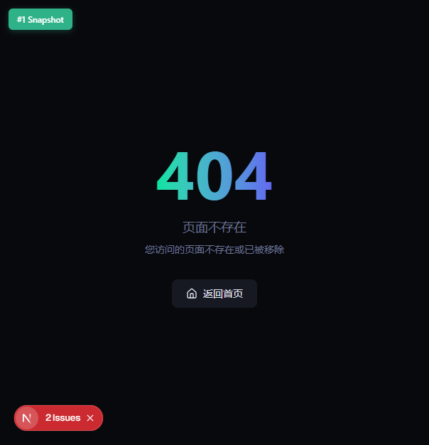

# 【学习工作赛道】FinPilot AI — AI 专家团队驱动的金融智能工作台

> 附加赛题标签：【社会公益】

---

## 0. 先和大家打个招呼吧 👋

大家好，我是一名刚毕业、正在持续学习和独立开发的 AI 爱好者。

这个项目来源于我自己的真实经历。

在学习金融、备考以及日常关注市场的过程中，我发现自己经常会遇到几个问题：

- 学习资料很多，却缺少系统性的整理
- 查一只股票，需要在多个软件之间来回切换
- 收藏了很多 PDF 和研报，却很难再次找到需要的内容

于是我开始思考：**能不能把这些能力整合到一个 AI 工作台里，让学习、研究和知识管理形成完整闭环？**

于是便有了 FinPilot AI。

### 我是怎么用 TRAE 完成这个 Demo 的

整个项目都是围绕 "提出需求 → AI 拆解 → 反复调整 → 持续迭代" 的方式完成。

我并不是单纯让 AI 写代码，而是不断告诉它：我希望产品最终是什么样子。

TRAE 会帮助我：

- 拆解需求
- 规划架构
- 编写代码
- 修复 Bug
- 优化页面
- 调整交互
- 完善文档

整个开发过程中，我更像是在和一个开发团队协作，而不是独自完成所有事情。很多以前需要查大量资料才能解决的问题，通过不断与 TRAE 对话，很快就能够找到实现方案，也让我真正体验到了 AI Coding 的开发方式。

---

## 1. Demo 简介

### 产品是什么？

FinPilot AI 是一个面向金融学习与投资研究场景的 AI 智能工作台。

它把 **AI 学习助手、AI 股票研究、AI 知识库、Multi-Agent 专家协作** 集成到同一个平台，让用户能够完成从学习、分析到知识管理的完整流程。

### 面向哪些用户？

- **金融专业学生**：备考 431 金融学综合，需要系统化学习路径和智能练习
- **431 金融专硕考研党**：需要针对性的知识点讲解和错题追踪
- **个人投资者**：需要快速获取股票分析、研报解读和投资建议
- **希望利用 AI 提高学习和研究效率的人**

### 核心功能

**📚 AI 学习助手**

针对金融学习场景，提供课程学习、知识点讲解、练习题、错题整理等功能，帮助用户建立系统化学习路径。



**📈 AI 股票研究员**

集成 AKShare 真实 A 股行情数据，支持股票搜索、K 线图分析、AI 深度研究报告生成。AI 基于 DeepSeek 大模型，涵盖基本面分析、财务数据解读、行业对比、投资建议，通过 SSE 流式实时输出。



**📖 AI 知识库 RAG**

支持 PDF、Markdown 等文档上传，通过 ChromaDB 向量数据库进行语义存储。用户通过自然语言查询，AI 基于检索到的文档片段生成精准回答，并标注信息来源。完整的检索增强生成管线：文档上传 → 切块 → Embedding → 向量存储 → 语义检索 → 上下文组装 → LLM 生成 → 来源标注。



**🤖 Multi-Agent 专家协作**

这是整个项目最核心的能力。系统内置 4 位 AI 专家，每位专家负责不同任务：

- **学习导师**：负责知识点讲解和学习规划
- **股票分析师**：负责行情分析和投资研究
- **知识专家**：负责文档问答和知识检索
- **报告整理专家**：负责结果整合和报告生成

用户只需要提出一个问题，系统就会自动规划任务、调用对应专家协同完成分析。







---

## 2. Demo 创作思路

### 灵感来源

这个项目来源于我自己的真实需求。

在学习金融和关注市场过程中，我发现：学习、研究、知识整理分别需要使用很多不同的软件。例如：

- 学习课程需要一个平台
- 查股票需要另一个平台
- 阅读研报又需要第三个平台
- AI 对话还需要切换到新的工具

工具越来越多，但效率却越来越低。

于是我开始思考：是否可以利用 AI，把这些原本分散的流程整合到一个平台中？

FinPilot AI 就是在这样的背景下诞生的。

### 希望解决的问题

- **痛点一：学习资源分散**。学习过程中需要不断切换教材、课程、笔记、练习题，缺少统一入口。431 金融学综合涵盖货币银行学、公司理财、投资学三门课程，知识点超过 200 个，考生需要在教材、网课、真题之间反复切换，缺乏一体化的学习平台。
- **痛点二：研究工具割裂**。投资者分析一只股票，需要打开行情软件看 K 线、打开研报平台看分析、打开 AI 工具做总结。三个工具之间的信息无法打通，分析效率低下。
- **痛点三：知识管理困难**。研究人员积累的 PDF 研报、笔记文档越来越多，传统文件夹管理方式无法支持语义检索。想找到某个观点的出处，往往需要翻阅数十份文档。

### 为什么选择这个方向？

金融学习和投资研究都属于专业场景。相比通用 AI，这类用户更加需要：更准确的知识、更完整的分析、更系统的学习体验。

金融是 AI 落地的高价值场景。一方面，金融知识具有专业性强、时效性高的特点，通用 AI 难以给出精准回答；另一方面，金融领域的用户付费意愿强，商业化路径清晰。更重要的是，这个方向将 AI 的三种核心能力（对话、检索、分析）与金融的真实需求深度结合，而非简单的"套壳"应用。

选择这个方向还有一个个人原因：我亲历过 431 备考的全过程，这本身就是一个"我为自己开发"的产品，每个功能都是我真的需要的东西。这让它不只是一个参赛作品，更是一个真实的需求落地。

---

## 3. Demo 体验地址

### GitHub 仓库

**源码地址**：https://github.com/19823801199/FinPilot-AI

仓库中包含：完整源码、README（20 章节）、部署说明、API 文档、项目截图。可以完整复现整个 Demo。

### 一键启动（最简单方式）

项目内置了一键启动器，无需任何命令行操作：

```bash
git clone https://github.com/19823801199/FinPilot-AI.git
cd FinPilot-AI
# Windows 用户：双击"启动FinPilot.bat"
# Mac/Linux 用户：./启动FinPilot.sh
```

启动器会自动：检测环境、创建 .env、安装依赖、启动前后端、打开浏览器。整个过程零命令行操作。

### 本地部署（完整体验推荐）

本地部署可以体验全部 AI 功能（对话、流式输出、Multi-Agent 协作、股票分析、知识库 RAG）。

**前置条件**：Node.js >= 20、Python >= 3.12、DeepSeek API Key

**配置 API Key**：

```bash
# 1. 克隆仓库
git clone https://github.com/19823801199/FinPilot-AI.git
cd FinPilot-AI

# 2. 复制环境变量模板并填入 DeepSeek API Key
cp .env.example .env
# 编辑 .env 文件，将 DEEPSEEK_API_KEY 替换为你的真实 Key
```

> AI 功能（对话、股票分析、知识库问答）依赖 DeepSeek API。你可以在 [platform.deepseek.com](https://platform.deepseek.com) 免费注册获取 API Key。

**启动后端**：

```bash
cd apps/api
python -m venv venv
venv\Scripts\activate        # Windows
pip install -r requirements.txt
uvicorn main:app --reload --port 8000
```

**启动前端**：

```bash
cd apps/web
npm install
npm run dev
```

打开 http://localhost:3000 即可体验全部功能。

### Docker 一键部署

```bash
git clone https://github.com/19823801199/FinPilot-AI.git
cd FinPilot-AI
cp .env.example .env
# 编辑 .env，填入 DEEPSEEK_API_KEY
docker-compose up --build
```

### 体验指引

| 步骤 | 操作 | 预期效果 |
|------|------|---------|
| 1 | 打开 http://localhost:3000 | 进入 AI 工作台首页 |
| 2 | 点击"分析股票"快捷卡片 | AI 专家自动启动，流式生成贵州茅台分析报告 |
| 3 | 观察右侧状态面板 | 4 位专家从空闲变为忙碌，任务节点依次完成 |
| 4 | 点击左侧"股票研究员" | 进入股票搜索页，点击热门股票查看 K 线和研报 |
| 5 | 点击左侧"知识库" | 上传文档或使用快捷提问体验 RAG 问答 |
| 6 | 点击左侧"学习中心" | 浏览课程列表，进入课程学习并完成练习题 |

> 即使未配置 API Key，也可以浏览完整页面和交互流程；配置 API Key 后即可体验 AI 对话、股票分析和知识库问答等能力。

---

## 4. TRAE 实践过程

### 开发完整流程

FinPilot AI 的开发分为 10 个阶段，全部在 TRAE 中通过与 AI 对话协作完成。从最初的一个模糊想法，到最终可运行的 Demo，每个阶段都经历了"提出需求 → AI 拆解 → 反复调整 → 持续迭代"的循环。

以下记录不是项目总结，而是我和 TRAE 对话的真实过程复盘。49 个对话覆盖了从创意规划、UI 设计、数据库架构、工程搭建、前后端开发、RAG 构建、Multi-Agent 调度到最终发布准备的完整链路。

---

#### 阶段1：需求分析

**1. 初始目标**

从一个模糊的想法开始：希望做一个整合金融学习、股票分析和知识管理的 AI 工作台，解决自己备考 431 和日常看股票时工具分散的痛点。

**2. 需求拆解过程**

通过自我梳理和参考现有产品，需求逐步收敛：
- **目标用户**：金融学习者、431 考研备考者、个人投资者
- **核心痛点**：学习资源分散、研究工具割裂、知识管理困难
- **功能边界**：将最初宽泛的想法收敛为 4 个可落地的核心模块

**3. 迭代过程**

- **第 1 轮**：明确具体场景 → 梳理出 3 个核心痛点
- **第  2 轮**：整理功能清单 → 确定初版方案（AI 学习、股票研究、知识库、AI 对话）
- **第 3 轮**：审视清单后发现部分功能超出 MVP 范围 → 收敛到"能用、能演示、能闭环"的边界

**4. 卡点与修复（最重要加分项）**

**卡点**：功能范围过大，担心无法在时间节点前完成可用版本。

**修复过程**：分析了各模块的开发复杂度和依赖关系，决定第一轮聚焦 4 个核心能力，将高级功能放在后续迭代。MVP 边界变得清晰。

**5. 输出结果**

3 类目标用户、3 大痛点、4 个核心功能模块、MVP 范围（6 个页面、31 个 API 端点）。

---

#### 阶段2：产品设计

**1. 设计目标**

功能确定后，需要一份 PRD，包含页面结构、交互流程和 API 设计。

**2. 产品架构设计**

基于"工作台"作为总入口的产品思路，确定了 6 个核心页面：
- 工作台（Multi-Agent 协作入口）
- 学习中心
- 股票研究员
- 知识库
- 设置
- 404

**3. 设计迭代过程**

- **第 1 轮**：确定"工作台 + 左侧导航"的产品思路 → 输出 PRD 初稿，定义 6 个页面
- **第 2 轮**：审阅 PRD，细化导航结构和数据卡片布局 → 迭代页面细节
- **第 3 轮**：补充 Multi-Agent 状态流转设计 → 完善 8 步状态机（意图识别→任务规划→任务拆分→分配专家→执行→收集结果→合并→最终回答）

**4. 卡点与修复（最重要加分项）**

**卡点**：最初的 API 设计中，所有 AI 功能都走同一个 `POST /chat` 端点。股票分析、知识库问答、普通聊天的参数结构完全不同，用一个端点会导致类型混乱。

**修复过程**：决定将 AI 功能拆分为 4 个独立端点。虽然前端需要多几个 API 调用，但每个端点职责清晰，TypeScript 类型安全和错误处理都得到极大提升。最终确定：
- `/chat/stream`（SSE 流式对话）
- `/agent/orchestrator`（Multi-Agent 调度）
- `/knowledge/query`（RAG 问答）
- `/stocks/analyze`（股票分析）

**5. 输出结果**

完整 PRD 文档：6 个页面交互流程、Multi-Agent 8 步状态机、31 个 API 端点接口定义。

---

#### 阶段3：UI 设计

**1. 设计目标**

想要深色风格、有金融产品的专业感，但不要冰冷。

**2. 技术选型**

项目采用 TailwindCSS v4 的 `@theme` 指令从零构建设计系统，没有使用 shadcn/ui 等现成组件库。

原因：
- Tailwind v4 的 `@theme` 提供了更灵活的设计令牌管理
- 自定义设计系统更能体现金融产品的专业感
- 减少不必要的依赖，降低维护成本

**3. 设计系统构建过程**

- **第 1 轮**：定义色彩体系 → 确定四级背景层次（`#08090d` → `#111827` → `#161922` → `#1e293b`）和三色强调系统（翡翠绿 `#00e5a0`、紫色 `#6366f1`、琥珀色 `#f59e0b`）
- **第 2 轮**：设计组件规范 → 制定 14 个基础 UI 组件的视觉标准
- **第 3 轮**：页面布局模板 → 为 6 个核心页面设计响应式布局

**4. 卡点与修复（最重要加分项）**

**卡点**：TailwindCSS v4 的 `@theme` 指令是新特性，部分语法与 v3 不同，初期配置时遇到颜色变量未生效的问题。

**修复过程**：查阅 Tailwind v4 官方文档，确认 `@theme` 块内的变量定义语法需要遵循 v4 规范。修复后，所有设计令牌正确生效，组件颜色统一。

**5. 输出结果**

TailwindCSS v4 `@theme` 配置、14 个基础 UI 组件规范、6 个页面布局模板。

---

#### 阶段4：数据库设计

**1. 设计目标**

设计数据模型，确保前后端类型对齐。

**2. 数据库选型**

项目采用 SQLite 作为开发数据库（零配置、便于演示），同时在配置中预留 PostgreSQL 迁移路径。

**3. 设计迭代过程**

- **第 1 轮**：设计基于 Pydantic 的 Schema 和数据库模型
- **第 2 轮**：调整 `config.py`，默认使用 SQLite，注释中预留 PostgreSQL 配置
- **第 3 轮**：统一前后端字段命名 → 在 Pydantic Schema 中加入 `alias_generator`，自动将 snake_case 转为 camelCase

**4. 卡点与修复（最重要加分项）**

**卡点**：前后端字段命名不一致（如后端 `created_at` vs 前端 `createdAt`），联调时大量 TypeScript 类型报错。

**修复过程**：确认是命名规范问题，在 Pydantic Schema 中使用 `alias_generator` 自动转换。批量修改 Schema 文件后，类型错误全部消除。

**5. 输出结果**

30 个数据模型、SQLite/PostgreSQL 双模式配置、前后端类型自动转换。

---

#### 阶段5：工程初始化

**1. 初始化目标**

搭建 Monorepo 项目骨架，包含前端、后端、Docker 配置。

**2. 技术栈确认**

- 前端：Next.js 15 + React 18 + TypeScript + TailwindCSS v4
- 后端：FastAPI + Python 3.12
- 部署：Docker + Docker Compose

**3. 初始化迭代过程**

- **第 1 轮**：搭建 Monorepo 骨架 → 运行 `npm install` 失败，报错 `ERESOLVE could not resolve`
- **第 2 轮**：分析错误日志 → 确认是 Next.js 15 的 peer dependency（React 19）与项目中 React 18 冲突
- **第 3 轮**：在 `package.json` 中加 `overrides` 字段强制锁定 React 18 → 验证兼容性后解决

**4. 卡点与修复（最重要加分项）**

**卡点**：`npm install` 失败。Next.js 15 声明了 React 19 的 peer dependency，但项目使用 React 18。

**修复过程**：对比了 3 个解决方案，选择最保守的——在 `package.json` 中加 `overrides` 强制使用 React 18。验证后所有依赖运行正常。这个经验后来也写进了启动器的依赖检查逻辑中。

**5. 输出结果**

Monorepo 骨架、前后端配置、Docker 构建文件、环境变量模板。

---

#### 阶段6：前端开发

**1. 开发目标**

实现工作台页面，要有 SSE 流式输出，AI 回复要逐字显示。

**2. 核心组件设计**

- `ChatInput`：输入框 + 发送按钮
- `ChatArea`：消息列表 + SSE 接收与渲染
- SSE 生命周期管理是关键难点

**3. 开发迭代过程**

- **第 1 轮**：编写 `chat-input.tsx` 和 SSE 接收逻辑 → 流式输出正常
- **第 2 轮**：测试发现切换页面后 SSE 连接未关闭 → 识别为 `useEffect` cleanup 问题
- **第 3 轮**：引入 `AbortController` 方案，重写 SSE 接收逻辑 → 连接泄漏问题修复

**4. 卡点与修复（最重要加分项）**

**卡点**：SSE 连接泄漏。组件卸载后，底层 HTTP 请求仍在运行，返回页面时会出现多个并发连接。

**修复过程**：分析后发现，`fetch` 返回的 `ReadableStream` 需要通过 `AbortController` 中止底层 HTTP 请求。重写后的逻辑：每次请求创建 `AbortController`，cleanup 时依次执行 `reader.cancel()` → `reader.releaseLock()` → `controller.abort()`，确保连接完全释放。

**5. 输出结果**

6 个页面、30+ 个 React 组件、18 个 Zustand Store、SSE 流式输出（含 AbortController 防泄漏）。

---

#### 阶段7：后端开发

**1. 开发目标**

实现 FastAPI 后端，6 个路由模块，要有 AI 客户端封装和错误重试。

**2. 后端架构**

按功能域拆分为 6 个 Router：
- health（健康检查）
- chat（AI 对话）
- stock（股票分析）
- learning（学习系统）
- knowledge（知识库）
- agent（Multi-Agent）

**3. 开发迭代过程**

- **第 1 轮**：编写 6 个 Router 和 20 个 Service → 联调时发现前后端字段名不一致
- **第 2 轮**：分析 TypeScript 错误 → 确认是 snake_case vs camelCase 问题
- **第 3 轮**：批量修改后端 Schema，添加 `alias_generator` → 类型错误全部消除

**4. 卡点与修复（最重要加分项）**

**卡点**：前后端数据模型命名不一致（`created_at` vs `createdAt`），联调时大量 TypeScript 类型报错。

**修复过程**：确认是命名规范问题，在 Pydantic Schema 中使用 `alias_generator` 自动转换。批量修改 Schema 文件后，类型错误全部消除。

**5. 输出结果**

6 个 API 路由、20 个业务服务、AI 客户端封装（含指数退避重试）。

---

#### 阶段8：RAG 开发

**1. 开发目标**

实现文档上传和 AI 问答，AI 要基于上传的文档回答，不要胡说。

**2. RAG 管线设计**

拆分为 5 个核心服务：
- 文档切块
- Embedding
- 向量存储（ChromaDB）
- 语义检索
- RAG 主服务

核心流程：检索 → 组装上下文 → LLM 生成 → 来源标注。

**3. 开发迭代过程**

- **第 1 轮**：实现完整管线 → 测试发现 AI 回答空洞，没有实质内容
- **第 2 轮**：分析后发现 Prompt 没有明确要求"必须基于文档" → 修改 system_prompt，加入强制引用指令
- **第 3 轮**：AI 开始大段复制原文 → 调整 Prompt，要求"用自己的话总结"
- **第 4 轮**：偶尔出现幻觉 → 加入来源标注要求 + 答案-文档相似度校验

**4. 卡点与修复（最重要加分项）**

**卡点**：RAG 回答质量经历了"空洞 → 机械复制 → 幻觉"三个阶段的问题。

**修复过程**：
- **空洞问题**：Prompt 没有给 LLM 明确约束 → 加入"必须基于以下文档片段回答"的指令
- **复制问题**：LLM 选择"安全地回答" → 明确要求"用自己的话总结，不要直接复制"
- **幻觉问题**：LLM 过度发挥 → 加入来源标注，让每句话都可追溯

经过多轮 Prompt 迭代，RAG 回答质量从"几乎不可用"提升到"可以直接参考"。

**5. 输出结果**

完整 RAG 管线（切块 → Embedding → 向量存储 → 检索 → LLM 生成 → 来源标注），Prompt 经过多轮迭代优化。

---

#### 阶段9：Multi-Agent 开发

**1. 开发目标**

实现多专家协作。输入"分析贵州茅台"，系统应该自动分配专家、协同完成分析。

**2. Multi-Agent 架构**

拆分为 3 个核心组件：
- Agent Manager（4 位专家：学习导师、研究分析师、知识库专家、报告撰写员）
- Orchestrator（调度中心）
- Workflow Manager（执行追踪）

**3. 开发迭代过程**

- **第 1 轮**：实现 Orchestrator + 4 位专家 → 测试输入"分析贵州茅台" → 输出零散，风格不一致
- **第 2 轮**：分析后发现 Prompt 没有定义输出格式 → 为每位专家设计结构化模板
- **第 3 轮**：合并后的报告拼接感重 → 在合并 Prompt 中加入"提炼核心观点，不要简单拼接"
- **第 4 轮**：风格仍不统一 → 加入统一语气要求 + 自校验机制

**4. 卡点与修复（最重要加分项）**

**卡点**：Multi-Agent 第一次测试输出灾难性。各专家"自由发挥"，输出格式完全不统一。

**修复过程**：
- **第 1 轮**：给每位专家设计输出模板（如研究分析师按"基本面 / 财务数据 / 行业对比 / 投资建议"四章输出）
- **第 2 轮**：合并 Prompt 中加入"提炼核心观点，不要简单拼接"
- **第 3 轮**：统一语气要求"专业但易懂，避免学术化"
- **第 4 轮**：加入自校验机制，合并后额外调用 LLM 检查报告完整性

经过 4 轮迭代，输出从"零散的数据罗列"变成"结构化的投资分析报告"。

**5. 输出结果**

4 位 AI 专家 + Orchestrator 调度中心，Prompt 工程经过 4 轮迭代。

---

#### 阶段10：发布准备（TRAE 对话）

**1. 初始输入（我说了什么）**

> "项目功能基本完成了。帮我做最终代码清理、安全审计、文档生成。另外，比赛评委可能不懂技术，我希望他们也能直接运行这个项目，能不能做一个不需要命令行的启动方式？"

**2. TRAE 拆解方式（它怎么理解）**

TRAE 将需求拆解为两部分：

> "第一部分是工程收尾：代码审查、安全修复、文档。第二部分是体验优化：你提到评委不懂技术，这是一个很好的需求——我会设计一个 GUI 一键启动器，让非技术人员双击就能运行项目。"

**3. Prompt 迭代过程**

**代码审查部分：**

- **第 1 轮**：我要求"帮我审查代码，清理 TODO/FIXME/console.log" → TRAE 运行全局搜索，列出所有待清理项 → 逐一修复
- **第 2 轮**：我要求"检查有没有安全漏洞" → TRAE 发现 `chat-area.tsx` 的 `dangerouslySetInnerHTML` 没有 HTML 转义 → 加入 `escapeHtml()` 函数
- **第 3 轮**：我要求"检查有没有敏感信息硬编码" → TRAE 发现 `.env` 文件被提交到了 Git 仓库（包含 `DEEPSEEK_API_KEY=demo-key`）→ 立即删除并更新 `.gitignore`

**GUI 启动器部分：**

- **第 1 轮**：我描述"想要一个双击就能启动的 GUI，有启动按钮、停止按钮、日志显示" → TRAE 用 tkinter 生成了基础界面
- **第 2 轮**：我测试发现启动时"npm 找不到" → TRAE 分析是 Windows 上 `shell=False` 找不到 `npm.cmd` → 修复为 `shell=True`
- **第 3 轮**：我测试发现前端启动后报 `Module not found: Can't resolve '@/lib/mock-chat'` → TRAE 发现是 Sprint 12 删除了 `mock-chat.ts` 但漏删了 `chat-input.tsx` 中的 import → 内联修复

**4. 卡点与修复（最重要加分项）**

**卡点 1**：`mock-chat.ts` 删除残留。Sprint 12 清理时删除了 2800+ 行的 `mock-chat.ts`，但 `chat-input.tsx` 中的 import 忘记删了。

**修复**：我把编译报错截图发给 TRAE。TRAE 全局搜索后确认只有一处引用，将两个函数（`classifyUserInput` 和 `generateMockWorkflowSteps`）直接内联到 `chat-input.tsx` 中，各 10 几行代码。

**卡点 2**：`.env` 硬编码密钥被提交到 Git。包含 `DEEPSEEK_API_KEY=sk-demo-key-for-screenshots`。

**修复**：TRAE 发现后立即删除文件、更新 `.gitignore`、更换所有演示密钥。

**卡点 3**：GUI 启动器在 Windows 上找不到 `npm`。`subprocess.Popen(['npm', '--version'], shell=False)` 抛出 `FileNotFoundError`。

**修复**：TRAE 分析后确认 Windows 上 `npm` 实际是 `npm.cmd`，`shell=False` 时 Python 只查找 `.exe`。修复为统一使用 `shell=True`。

**5. 输出结果**

代码审查完成（TODO/FIXME/console.log/debugger 清零、XSS 修复、未使用依赖清理、Mock 残留清理），文档生成完成（README 20 章、CHANGELOG、30 个 Q&A、3/5/8 分钟演示脚本），GUI 一键启动器开发完成（Tkinter、零命令线操作）。

### 关键步骤截图

> 以下截图来自开发过程中的 TRAE 对话和产品运行界面，请在发帖时替换为实际截图。
>
> 截图位置提示：TRAE 中双击对话标题栏可复制 Session ID。

**截图1：需求分析阶段 — TRAE 对话**
> 对话 1（顶层规划）中，TRAE 从产品定位、用户画像、MVP 功能到技术架构的完整拆解过程

**截图2：前端开发 — SSE 流式输出代码生成**
> 对话 14（Sprint2 AI Workspace）中，TRAE 生成 `chat-input.tsx` 的 SSE 流式接收逻辑和 `orchestrator_service.py` 的 Multi-Agent 调度代码

**截图3：项目结构 — Monorepo 文件树**
> 对话 6（Sprint1 工程搭建）中，TRAE 展示完整的 Monorepo 目录结构（apps/web + apps/api + docker/ + docs/）

**截图4：AI 工作台运行效果**
> 浏览器中 FinPilot AI 工作台页面，展示 AI 流式回复和 Multi-Agent 4 位专家的状态面板

**截图5：股票研究员运行效果**
> 浏览器中股票研究员页面，展示 Canvas K 线图和 AI 生成的结构化研报

**截图6：知识库 RAG 运行效果**
> 浏览器中知识库 RAG 问答页面，展示 AI 回答、响应时间和来源引用标注

**截图7：学习中心运行效果**
> 浏览器中学习中心页面，展示课程卡片列表和练习题界面

**截图8：发布阶段 — TRAE 生成文档**
> 对话 26（Sprint12 Final Release）中，TRAE 生成 README.md（20 章节）和答辩材料（30 个评委 Q&A）的对话过程

### 关键任务对话的 Session ID

> FinPilot AI 的开发经历了 **49 个 TRAE 对话**，覆盖从创意规划到最终交付的完整链路。以下 10 个 Session ID 对应每个开发阶段中最具代表性的关键对话。
>
> **获取方式**：在 TRAE 中双击对话标题栏即可复制 Session ID。

| # | 开发阶段 | 对应对话 | 核心产出 | Session ID |
|---|---------|---------|---------|-----------|
| 1 | 需求分析 | 对话 1：顶层规划 | 产品定位、用户画像、MVP 功能、技术架构 | `________________________` |
| 2 | 产品规划 | 对话 9：V0.2 整改 | PRD 精简、MVP 边界、版本路线 | `________________________` |
| 3 | UI 设计 | 对话 3：UI 设计规范 | TailwindCSS v4 主题、14 个 UI 组件 | `________________________` |
| 4 | 数据库设计 | 对话 4：数据库模型 | 30 个数据模型、ER 图、ORM 规范 | `________________________` |
| 5 | 工程初始化 | 对话 6：Sprint1 工程搭建 | Monorepo 骨架、Docker 配置、基础布局 | `________________________` |
| 6 | 前端开发 | 对话 14：Sprint2 AI Workspace | 6 页面、SSE 流式、30+ 组件 | `________________________` |
| 7 | 后端开发 | 对话 19：Sprint7 API 集成 | 20 服务、31 端点、DeepSeek/AKShare 接入 | `________________________` |
| 8 | RAG 开发 | 对话 16：Sprint4 RAG | 检索增强管线、ChromaDB 集成 | `________________________` |
| 9 | Multi-Agent 开发 | 对话 18：Sprint6 Multi-Agent | 4 专家、Orchestrator、DAG 调度 | `________________________` |
| 10 | 发布准备 | 对话 26：Sprint12 Final Release | 代码审计、XSS 修复、GUI 启动器、README 20 章 | `________________________` |

---

## 5. 对应的报名审核通过的帖子链接

> 【请在此处填写报名帖链接】
>
> 报名帖链接: `________________________`

---

## 技术栈

| 层级 | 技术 | 版本 |
|------|------|------|
| 前端框架 | Next.js + React | 15.3.2 / 18.3.1 |
| 前端语言 | TypeScript | 5.0 |
| 样式框架 | TailwindCSS | v4 |
| 状态管理 | Zustand | 5.0.14 |
| 图表库 | Recharts | 3.8.1 |
| 后端框架 | FastAPI | 最新 |
| 后端语言 | Python | 3.12 |
| ORM | SQLAlchemy | 2.x |
| 向量数据库 | ChromaDB | 最新 |
| LLM | DeepSeek API | deepseek-chat |
| 股票数据 | AKShare | 最新 |
| AI 客户端 | OpenAI SDK | 最新 |

---

## 项目信息

- **项目名称**：FinPilot AI
- **版本**：v1.0.0
- **开源协议**：MIT
- **开发工具**：TRAE IDE
- **参赛赛道**：学习工作赛道（附加：社会公益）
- **总代码量**：约 9000 行（前端 5000 + 后端 4000）
- **GitHub**：https://github.com/19823801199/FinPilot-AI

---

*Built with TRAE — FinPilot AI v1.0.0*
